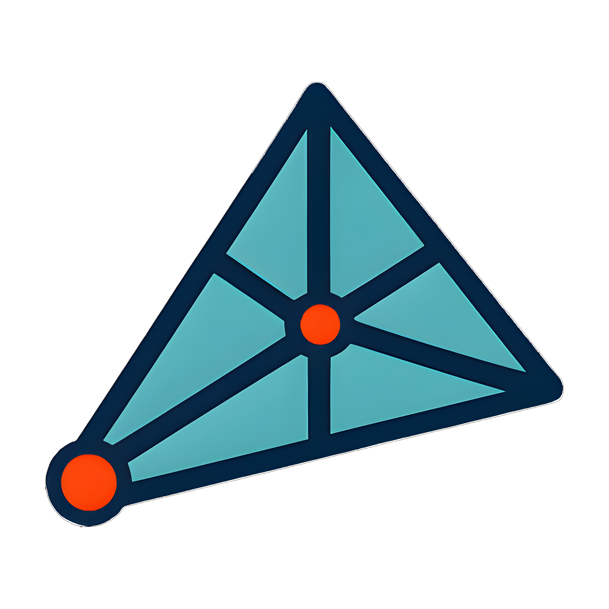

<div align="center">



# Elementa

**Open-source Finite Element Method (FEM) simulation workbench for Python**

[](https://pypi.org/project/elementa/)
[](https://pypi.org/project/elementa/)
[](https://www.gnu.org/licenses/gpl-3.0)
[](https://github.com/soheilgreen/elementa/actions/workflows/ci.yml)
[](https://soheilgreen.github.io/elementa/)

[**Documentation**](https://soheilgreen.github.io/elementa/) · [**Quickstart**](#quickstart) · [**Examples**](docs/guides/examples.md) · [**Contributing**](CONTRIBUTING.md)

</div>

---

## Overview

**Elementa** is a desktop FEM simulation environment built entirely in Python. It combines a parametric CAD modeller, an automatic mesh generator, physics solvers, and an interactive results viewer in a single application — without requiring commercial licences or external solvers.

| Feature | Details |
|---|---|
| **Geometry** | 2-D (rectangle, disk, polygon) and 3-D (box, sphere, cylinder) primitives with boolean operations |
| **Meshing** | Automatic triangular / tetrahedral meshing via [gmsh](https://gmsh.info/) |
| **Physics** | Electrostatics · Heat Transfer (stationary & transient) |
| **Solvers** | [scikit-fem](https://github.com/kinnala/scikit-fem) FEM back-end; backward-Euler time stepping |
| **Post-processing** | Surface plots, arrow / vector plots, point & line probes |
| **Parameters** | Symbolic parametric expressions with dependency resolution |
| **File format** | Portable `.elem` project archive (ZIP-based JSON + mesh + results) |

---

## Screenshots

<div align="center">
  
</div>

---

## Quickstart

### Requirements

- Python **3.10 – 3.12**
- A working C compiler (required by `gmsh` wheels on some platforms)

### Install from PyPI

```bash
pip install elementa
```

### Launch the GUI

```bash
elementa
# or
python -m elementa
```

### Install from source

```bash
git clone https://github.com/soheilgreen/elementa.git
cd elementa
pip install -e ".[dev]"
```

---

## Physics Modules

### Electrostatics

Solves the Poisson equation for electric potential:

$$-\nabla \cdot (\varepsilon_0 \varepsilon_r \nabla \varphi) = \rho$$

**Boundary conditions:** Electric Potential, Ground, Surface Charge Density, Zero Charge  
**Results:** Electric potential φ (V), Electric field **E** (V/m)

### Heat Transfer

Solves the heat equation (stationary and transient):

$$\rho C_p \frac{\partial T}{\partial t} - \nabla \cdot (k \nabla T) = Q$$

**Boundary conditions:** Temperature, Heat Flux, Convection, Thermal Insulation  
**Results:** Temperature T (K), Heat flux **q** (W/m²)

---

## Project Structure

```
elementa/
├── elementa/
│   ├── __init__.py          # Package metadata
│   ├── __main__.py          # CLI entry point
│   ├── assets/              # Icons and images
│   ├── cad/
│   │   └── cad.py           # gmsh CAD wrapper (ElementaCAD)
│   ├── core/
│   │   ├── cad_builder.py   # Orchestrates geometry build from project state
│   │   ├── evaluator.py     # Parametric expression evaluator
│   │   ├── exceptions.py    # Custom exception hierarchy
│   │   ├── geometry_registry.py  # Shape descriptors registry
│   │   ├── logger.py        # Logging configuration
│   │   ├── material_library.py   # Built-in material database
│   │   └── project_state.py # Central state + serialisation
│   ├── physics/
│   │   ├── base.py          # PhysicsState data class
│   │   ├── registry.py      # Plugin registry & descriptors
│   │   ├── electrostatics.py
│   │   └── heat_transfer.py
│   └── ui/
│       ├── main_window.py   # Main application window
│       ├── graphics_canvas.py
│       ├── model_builder.py
│       ├── plot_window.py
│       ├── expr.py          # Safe mathematical expression evaluator
│       └── panels/          # Dockable settings panels
├── docs/                    # GitHub Pages documentation
├── tests/                   # Test suite
├── pyproject.toml
├── CHANGELOG.md
├── CONTRIBUTING.md
└── LICENSE
```

---

## Adding a New Physics Module

Elementa uses a plugin architecture. To add a new physics solver:

1. Create `elementa/physics/my_physics.py`
2. Subclass `PhysicsDescriptor` and implement `assemble_and_solve()`
3. Call `register_physics(MyDescriptor)` at module level
4. Import it in `elementa/physics/__init__.py`

See [`docs/guides/adding-physics.md`](docs/guides/adding-physics.md) for a complete walkthrough.

---

## Dependencies

| Package | Purpose |
|---|---|
| [PyQt6](https://pypi.org/project/PyQt6/) | GUI framework |
| [gmsh](https://pypi.org/project/gmsh/) | CAD geometry & mesh generation |
| [scikit-fem](https://pypi.org/project/scikit-fem/) | FEM assembly & solvers |
| [NumPy](https://numpy.org/) | Numerical arrays |
| [Matplotlib](https://matplotlib.org/) | Results visualisation |

---

## Contributing

Contributions are very welcome! Please read [CONTRIBUTING.md](CONTRIBUTING.md) before opening a pull request.

- **Bug reports** → [GitHub Issues](https://github.com/soheilgreen/elementa/issues)
- **Feature requests** → [GitHub Issues](https://github.com/soheilgreen/elementa/issues)
- **Pull requests** → see [CONTRIBUTING.md](CONTRIBUTING.md)

---

## License

Elementa is released under the [GPL v3 License](LICENSE).

